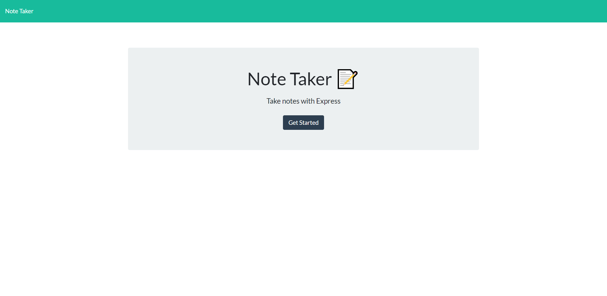
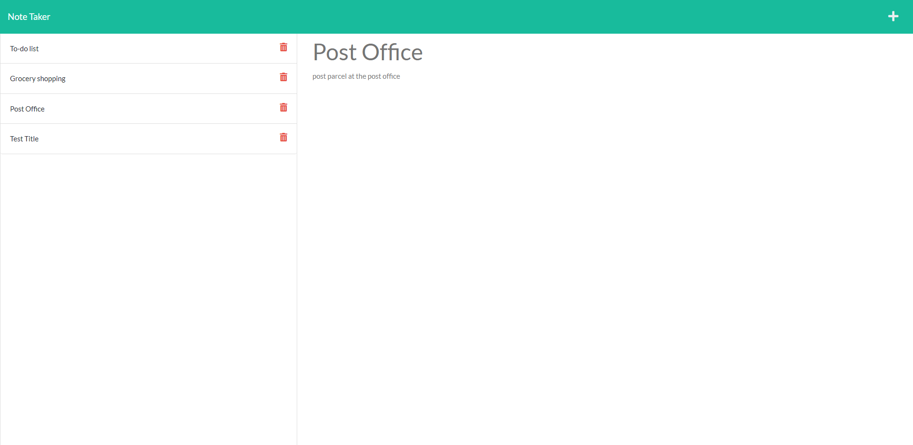

# Note Taker 

## Description:

For this project, I created note taker using Express and node.js which helps the user stay organized by saving and deleting notes when needed.

## links:

- Heroku: https://sheltered-stream-18510.herokuapp.com/
- Github repo: https://github.com/AsmaaMusse/note-taker/tree/dev

## Usage:

```
npm run start
```

## Endpoints - /api

- Get example:

```
[
  {
    "id": "543d01ef-a530-46ef-ac26-f298c78b2842",
    "title": "Post Office",
    "text": "Send parcel at the post office"
  }
]

```

- Post (using postman):

```
{
    "id": "4d2ca0f3-597d-488a-80f9-a8aad04c9b91",
    "title": "notes Title",
    "text": "note"
  }

```

- Delete:

Delete targeting the notes id using the Postman app.

## Technologies used:

- HTML
- CSS
- Javascript
- Node.js/ Nodemon
- Express.js

## Screenshots:



